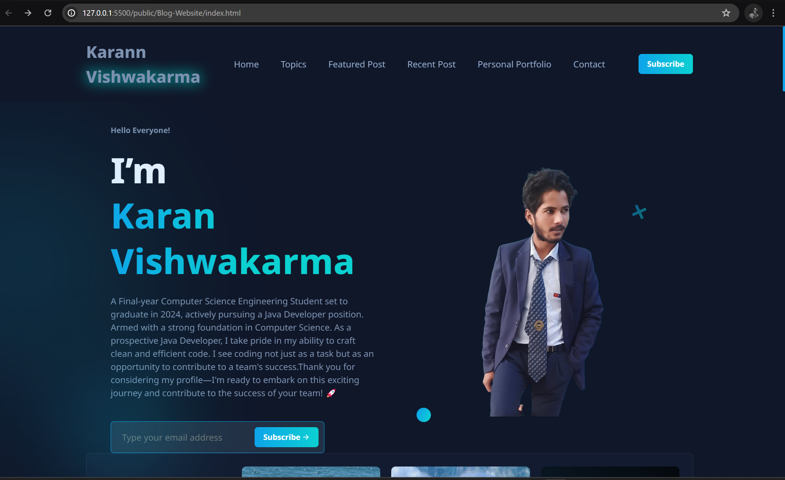

<div align="center">
  
  
[](https://twitter.com/CodeWithKarann)
  []
  []
  []

  <br />
  <br />

  <h2 align="center">Karann - Personal Blog Website</h2>

  This website is a fully responsive personal blog website, <br />Responsive for all devices, build using HTML, CSS, and JavaScript Only.

  <a href="https://github.com/karanvishwakarmaa/"><strong>➥ Live Demo</strong></a>

</div>

<br />

### Demo Screeshots



### Prerequisites

Before you begin, ensure you have met the following requirements:

* [Git](https://git-scm.com/downloads "Download Git") must be installed on your operating system.

### Run Locally

To run **Karann** locally, run this command on your git bash:

Linux and macOS:

```bash
sudo git clone https://github.com/karanvishwakarmaa/C-Personal-Portfolio
```

Windows:

```bash
git clone https://github.com/karanvishwakarmaa/C-Personal-Portfolio
```

### Contact

If you want to contact with me you can reach me at [Twitter](https://www.twitter.com/Royalkarann).

### License

[MIT](https://github.com/karanvishwakarmaa/C-Personal-Portfolio/blob/main/LICENSE)
